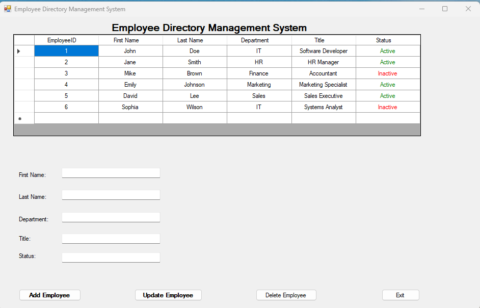

# Employee Directory Management System

## Preview

## Overview
This is a **VB.NET Windows Forms Application** that connects to a SQL Server database and manages employee records.  
It allows users to **view, add, update, and delete** employee information using a clean graphical user interface (GUI).

## Features
- Load employee data into a DataGridView.
- Display employee records with column auto-size and color-coded status.
- Add new employees.
- Update existing employee records.
- Delete selected employees.
- Structured exception handling (Try...Catch blocks).
- User-friendly UI with neatly aligned textboxes and action buttons.

## Technical Details
- Language: **VB.NET** (Visual Basic .NET)
- Framework: **.NET Framework 4.8**
- Database: **SQL Server Express** (LocalDB)
- UI Framework: **Windows Forms (WinForms)**
- Version Control: **GitHub**

## Setup Instructions
1. Clone this repository.
2. Open the solution (`EmployeeDirectory.sln`) in Visual Studio.
3. Update the database connection string if necessary.
4. Build and run the project.

## Future Improvements
- Add input validation for employee fields.
- Implement Entity Framework for database operations.
- Add authentication for admin/user roles.

## Related Project
Check out the [EmployeeFormProject](https://github.com/CyberKnight2025/EmployeeFormProject) for another VB.NET Windows Forms project!
